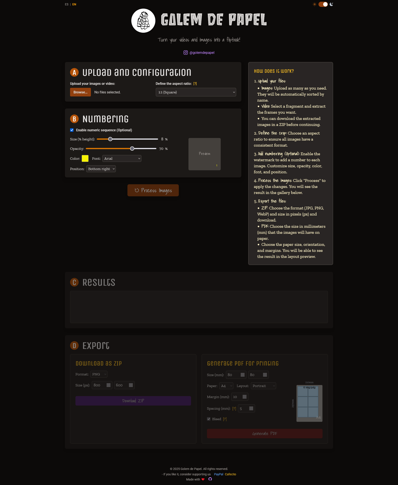

# 🌐 Golem de Papel



---

## 📍 🔗 **[Ver el sitio online](https://ramamc.github.io/Golem/)**

---

| Español | English |
|---------|---------|
| ## 📖 Descripción  
<br> **Golem de Papel** es una aplicación web ligera para preparar imágenes destinadas a la construcción de folioscopios mecánicos. 
<br> Permite cargar imágenes o videos, editarlos y exportarlos en un formato listo para imprimir y montar. 
| ## 📖 Description  
<br> **Golem de Papel** is a lightweight web application to prepare images for building mechanical flipbooks. 
<br> It allows users to load images or videos, edit them, and export ready-to-print layouts. |
| ### 🚀 Funcionalidades 
<br> - Carga de imágenes y extracción de fotogramas desde video 
<br> - Herramientas de recorte, escala y ajuste de relación de aspecto 
<br> - Organización de secuencias para folioscopios 
<br> - Exportación a PDF con marcas de corte 
<br> - Descarga opcional en ZIP 
<br> - Funciona localmente en el navegador, sin servidor 
| ### 🚀 Key Features 
<br> - Import images or extract frames from video 
<br> - Crop, scale, and aspect-ratio adjustment tools 
<br> - Sequence organization for flipbook construction 
br> - PDF export with cut marks 
<br> - Optional ZIP package download 
<br> - Runs locally in the browser, no server required |
| ### ⚙️ Instalación y uso 
<br> 1. Clonar el repositorio:  
<br> ```bash 
<br> git clone https://github.com/ramamc/Golem.git 
<br> ``` 
<br> 2. Abrir `index.html` en un navegador moderno 
<br> 3. No requiere instalación adicional 
| ### ⚙️ Installation & Usage 
<br> 1. Clone the repository:  
<br> ```bash 
<br> git clone https://github.com/ramamc/Golem.git 
<br> ``` 
<br> 2. Open `index.html` in any modern browser 
<br> 3. No additional setup required |
| ### 📜 Licencia 
<br> © 2025 Golem de Papel. Todos los derechos reservados. 
| ### 📜 License 
<br> © 2025 Golem de Papel. All rights reserved. |

